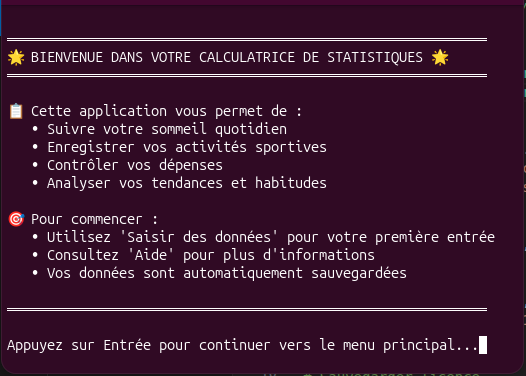
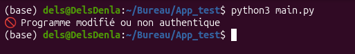
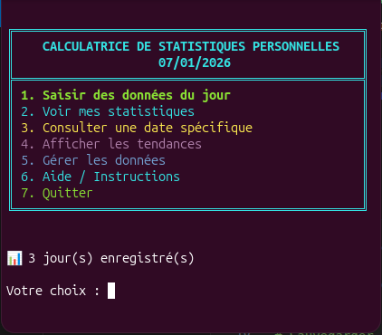

<p align="center">
  
</p>


<p align="center">
  Calculatrice corporelle intelligente : Sport, Sommeil et Finances
</p>

<p align="center">
  
  
  
</p>


## 📖 Introduction
**BioFlux** est une application centralisée conçue pour les utilisateurs soucieux de leur santé. Elle permet de suivre l'évolution physique (performances sportives, récupération) tout en gardant un œil sur l'impact financier de leurs habitudes de vie.


<p align="center">
  
</p>


## ✨ Fonctionnalités principales
### ⚠️ _IMPORTANT_
1. _Le code source est signé avec une clé privée (non publiée)_
2. _Au lancement, le programme vérifie :_
   - _l’intégrité du code_
   - _la validité de la licence_
3. _Toute modification entraîne l’arrêt automatique du programme_
4. _Si vous avez besoin de la clé pour pouvoir, modifier le projet, écrivez-moi. C'est gratuit_

### 📝 Gestion des données

- Saisie quotidienne intuitive des données (sommeil, sport, dépenses)
- Consultation détaillée par date avec navigation interactive
- Modification et suppression des entrées existantes
- Système de sauvegarde automatique avec rotation des backups

### 📊 Statistiques avancées
- **Statistiques par catégorie** : sommeil, sport, dépenses
- **Analyses temporelles** : 7/30 derniers jours, mois en cours/précédent
- **Périodes personnalisées** : définissez vos propres plages d'analyse
- **Comparaison de périodes** : comparez deux intervalles de temps
- **Rapport complet** : vue d'ensemble avec recommandations personnalisées
- **Export des rapports** : sauvegarde en format TXT

### 📈 Analyse des tendances
- Évolution sur 7, 30 jours ou période personnalisée
- Comparaison mois par mois
- **Graphiques ASCII** : visualisation pour sommeil, sport, dépenses
- Analyse par jour de la semaine
- Détection de cycles et habitudes récurrentes
- Suivi des objectifs vs réalisations
- Prédictions basées sur les tendances historiques

### 💾 Import/Export
- **Formats supportés** : JSON, CSV
- Export en fichiers CSV séparés par catégorie
- Import avec fusion intelligente des données existantes
- Système de backup complet avec gestion des versions

### 🔧 Maintenance
- Nettoyage automatique des données vides
- Vérification de l'intégrité des données
- Statistiques sur les fichiers
- Gestion des backups (création, listage, restauration, suppression)

## 🏗️ Structure du projet

```
BioFlux/
├── App
│   ├── BioFlux.exe (Windows)
│   ├── BioFlux.bin (Ubuntu)
├── main.py                 # Point d'entrée de l'application
├── modules/
│   ├── fonction.py        # Fonctions principales
│   ├── statistiques.py    # Calculs statistiques
│   ├── tendance.py        # Analyses de tendances
│   ├── integrite.py       # Vérification d'intégrité
│   └── license_check.py   # Gestion des licences
├── tools/
│   ├── generate_license.py
│   └── sign.py            # Signature du projet
├── Data/                  # Données utilisateur
│   └── ini.json           
├── public_key.pem         # Clé publique
├── private_key.pem        # Clé privée (à garder secrète)
├── license.json           # Fichier de licence
├── license.sig            # Signature de licence
├── signature.sig          # Signature du projet
├── Fonction.md
└── README.md
```

## 🚀 Installation

### Prérequis
- Python 3.8 ou supérieur
- pip (gestionnaire de paquets Python)

### Étapes d'installation

1. **Cloner le dépôt**
   ```bash
   git clone https://github.com/delsDin/BioFlux
   cd BioFlux
   ```

2. **Créer un environnement virtuel** (recommandé)
   ```bash
   python -m venv venv
   source venv/bin/activate  # Sur Windows: venv\Scripts\activate
   ```

3. **Installer les dépendances**
   ```bash
   pip install -r requirements.txt
   ```

4. **Lancer l'application**
   ```bash
   python main.py
   ```

## 📦 Dépendances

- `cryptography` - Pour la gestion de la sécurité et des signatures
- Autres dépendances standard Python (json, datetime, pathlib, etc.)

## 🎯 Utilisation

### Menu principal

1. **Saisir des données du jour** : Enregistrez vos données quotidiennes
2. **Voir mes statistiques** : Accédez aux analyses détaillées
3. **Consulter une date spécifique** : Consultez et modifiez les données d'un jour précis
4. **Afficher les tendances** : Visualisez l'évolution de vos habitudes
5. **Gérer les données** : Import/export, backups, maintenance
6. **Aide / Instructions** : Guide d'utilisation complet

### Exemples d'utilisation

**Saisie rapide**
- Lancez l'application et choisissez l'option 1
- Suivez les instructions pour entrer vos données de sommeil, sport et dépenses

**Analyse de tendances**
- Menu principal → Option 4
- Choisissez la période d'analyse souhaitée
- Visualisez les graphiques et statistiques

**Export de données**
- Menu principal → Option 5 → Option 3
- Vos données sont exportées en format CSV

## 🔒 Sécurité



BioFlux intègre plusieurs mécanismes de sécurité robustes pour garantir l'intégrité et l'authenticité du logiciel :

### 🔐 Signature cryptographique du projet

Le projet utilise un système de signature numérique basé sur **RSA** avec les primitives cryptographiques de la bibliothèque `cryptography`.

#### Fonctionnement

**1. Génération des clés (sign.py)**
```python
generate_keys()  # Génère une paire de clés RSA (privée/publique)
sign_project()   # Signe le projet avec la clé privée
```

**2. Vérification de l'intégrité (integrite.py)**

Les fichiers suivants sont vérifiés à chaque démarrage :
- `main.py`
- `modules/integrite.py`
- `modules/fonction.py`
- `modules/statistiques.py`
- `modules/tendance.py`
- `modules/license_check.py`

**Processus de vérification** :
```python
verify_signature() -> bool
```
1. Chargement de la clé publique (`public_key.pem`)
2. Recalcul du hash SHA-256 des fichiers critiques
3. Chargement de la signature (`signature.sig`)
4. Vérification cryptographique avec padding PSS

⚠️ **Si la signature ne correspond pas**, l'application refuse de démarrer pour éviter l'exécution de code modifié ou compromis.

### 📜 Système de licence

**Structure de la licence (license.json)** :
```json
{
  "user": "Dinla Marcel",
  "product": "BioFlux",
  "date": "29/12/2025",
  "expiry": "2030-12-31",
  "user_id": "f0d5c5e160ed3640..."
}
```

**Génération d'une licence (generate_license.py)** :
```bash
python tools/generate_license.py
```

Ce script :
1. Crée le fichier `license.json` avec les informations utilisateur
2. Charge la clé privée pour signer les données
3. Génère `license.sig` contenant la signature

**Vérification de la licence (license_check.py)** :
```python
verify_license() -> bool
```
- Vérifie la signature de la licence avec la clé publique
- Contrôle la date d'expiration
- Valide l'identifiant machine (protection contre le partage, fonction inactivée dans le code source)

### 🛡️ Autres mécanismes de sécurité

- **Validation des données** : Contrôles d'intégrité automatiques sur les fichiers JSON
- **Backups sécurisés** : Système de rotation avec conservation des versions
- **Gestion des erreurs** : Robustesse contre les corruptions de données

### 🔑 Génération des clés (Développeurs)

Pour générer une nouvelle paire de clés pour votre propre instance :

```bash
python tools/sign.py
```

Cela créera :
- `private_key.pem` - **À CONSERVER EN SÉCURITÉ** et ne jamais partager
- `public_key.pem` - Peut être distribuée avec l'application
- `signature.sig` - Signature du projet


## 📝 Licence

Ce projet est sous licence propriétaire. Voir le fichier `license.json` pour plus de détails.

## 👤 Auteur

<p align="center">
  
</p>
<p align="center">
<b>Dels Dinla Marcel</b>
</p>
<p align="center" style="color : #00ccff">
Data Scientist en Licence 1 à l'Institut de Formation et de Recherche en Informatique (IFRI Bénin)
</p>


## 📧 Support

Pour toute question ou problème, veuillez ouvrir une issue sur GitHub.


## 📊 Captures d'écran

<p align="center">
  
</p>

---

⭐ Si vous aimez ce projet, n'hésitez pas à lui donner une étoile sur GitHub !
